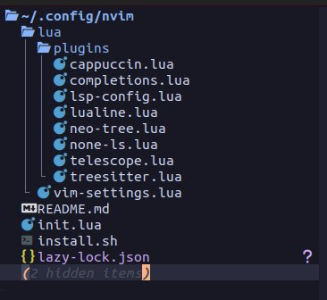
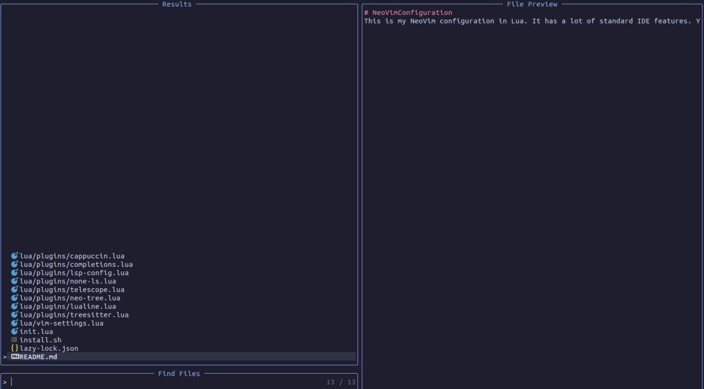
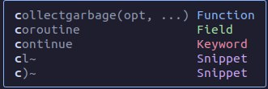
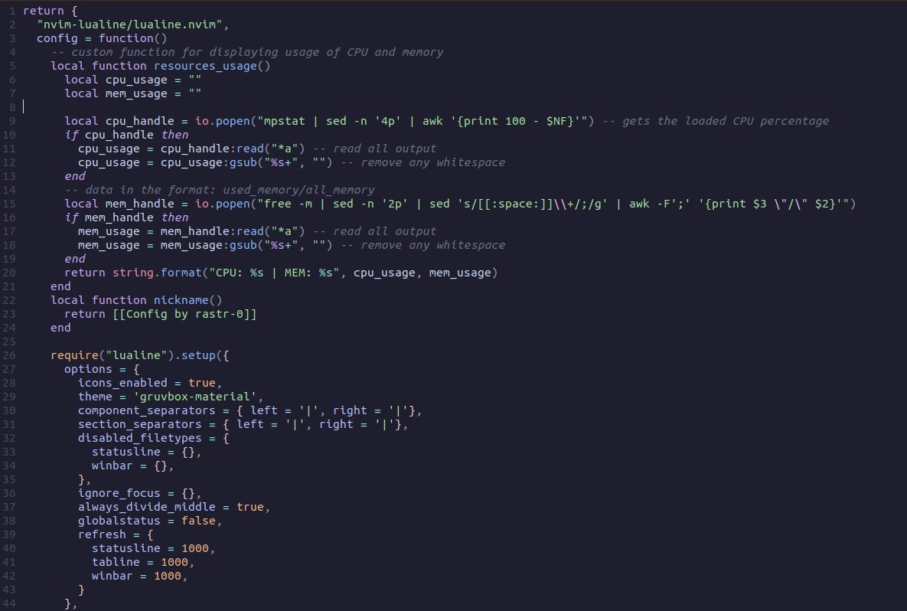
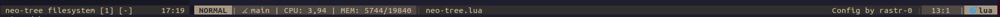

# NeoVimConfiguration
Welcome to the NeoVim configuration for efficient coding experience. This setup uses Lazy package manager to automatically install and manage plugins.

## Table of Contents

- [Preview](#preview)
- [Features](#features)
- [Prerequisites](#prerequisites)
- [Installation](#installation)
- [Contributing](#contributing)

## Preview

1. Filesystem sidebar

2. Telescope

3. Snippets + LSP

4. Syntax highlighting

5. Lualine

## Features

- **Lazy Package Manager**: Automatically installs and manages plugins.
- **Customized Keybindings**: Optimazed for popular tasks.
- **Telescope**: Live grep and finder.
- **Treesitter**: Syntax highlighting for all modern languages.
- **Neo-Tree**: Sidebar for browsing filesystem.
- **Lualine**: Fast and customizable bottom statusline
- **Catppuccin**: Postel theme.
- **LSP Support**: Language Server Protocol for code intelligence, including:
  * Autocompletion
  * Snippets for all modern languages
  * Formatter for Lua, C, C++ and Bash

## Prerequisites

Ensure your system meets the following requirements:

- A Unix-like operation system (Linux, MacOS)
- `sudo` privileges

## Installation

Follow these steps to install the NeoVim configuration:

1. **Clone the Repository**:
   `git clone https://github.com/rastr-0/NeoVimConfiguration`
   `cd NeoVimConfiguration`
2. **Run the Installation Script**
  `./installation.sh`

The script will:
- Check for dependencies (`wget`, `unzip`, `sysstat`, `NeoVim`)
- Create the necessary configuration directories
- Move configuration files to the appropriate locations
- Download and install the `Hach Nerd Font`

## Contributing
Contributions are welcome! Please follow these steps:
1. Fork repository
2. Create a new branch(`git checkout -b new_branch`)
3. Commit your changes(`git commit -am "Describe your feature"`)
4. Push to the branch(`git push origin new_branch`)
5. Create a new Pull Request
